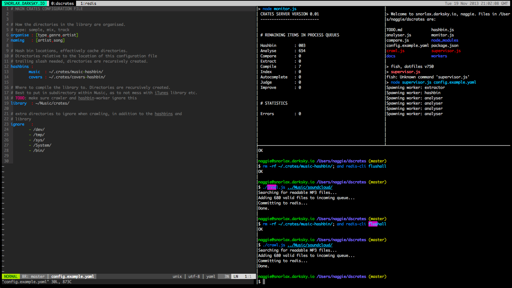

**WARNING, THIS WILL CLOBBER YOUR EXISTING CONFIGURATION BY DESIGN**

Running `./install.sh` will set up a generic version. Running `./install.sh <preset> <preset> ...`
will run the specified post-install scripts in `presets`. Therefore it can be (and is) also used
by several other humans, usernames and operating systems. It also stops people
from committing as me, for example.

For:

  * tmux 1.6+ (which is automatically launched, but only when it's needed)
  * vim 7.3+
  * fish >2.0 (bash, if you don't have fish > 2.0)
  * SSH
  * git (obviously)
  * keychain
  * Dark xterm-256color compatible UTF-8 terminal, SGR 1006 mouse enabled (iTerm2, xterm, urxvt-unicode)
  * mcabber 0.10.1+
  * mpc/ncmpcpp

Installation
------------

**Personal** Installation with local repository:

  1. Clone this repo (depends on git for submodules)
  2. Run `./install.sh <preset>`

To update, run `git pull && ./install.sh` which will also take care of submodules.

To install **globally** (to `/etc/skel/`) run `sudo ./install.sh`.  This way
*new* users will automatically get a personal, generic, copy of dotfiles. They
are then free to delete or modify.

Automated updates
-----------------

To automatically  update, put something like this in your crontab (via crontab -e):

	24 13 * * * cd dotfiles/ && git pull origin master && ./install.sh &> ../dotfiles.log

Why fish?
---------

  * Amazing suggestion engine (parses man files for options)
  * Great completion engine (looks at history for commands)
  * _All_ variables are arrays of strings, and variables are _not_ further split after substitution (no more "${string[@]}" cryptic nonsense)
  * It's event based
  * It's fast!
  * Real-time syntax highlighting!
  * It's like bash, but without the ambiguity

Read http://fishshell.com/tutorial.html for more information. Recently,
development was picked up on github by [ridiculous\_fish][1].

[1]: https://github.com/fish-shell/fish-shell/

Xterm
-----

Xterm is the reference terminal emulator, and is supported. Get version 277 or
later to support the mouse with universal co-ordinates. Compile it, after
installing the x11 and xav dev libraries with:

	xmkmf
	./configure --enable-256-color --enable-luit --disable-tek4014
	make
	sudo make install

Urxvt seems faster than xterm, and is now also supported. This is preferred.

----
See http://hivelogic.com/articles/top-10-programming-fonts for the best
terminal font. I prefer Consolas and Menlo on OS X.

Documentation
-------------

Discussion and documentation is heavily commented within each configuration file.

Interface differences:

### Vim
  * New commands: `vimtail` `vimhex`.
  * NERDtree toggles in normal mode with Tab.

### tmux
  * 

Shortcomings
------------

  * [Mouse support in large terminals][4] is broken with most terminal emulators, except (at least) iTerm2, recent xterms (>277) and urxvt.
  * [Flow control][2] causes unexpected terminal freezing. Switched off in bashrc, [switch pending in fish][3]

[2]: http://unix.stackexchange.com/questions/12107/how-to-unfreeze-after-accidentally-pressing-ctrl-s-in-a-terminal
[3]: https://github.com/fish-shell/fish-shell/issues/814
[4]: http://superuser.com/questions/413351/weird-insertion-from-vim-on-mouse-click
